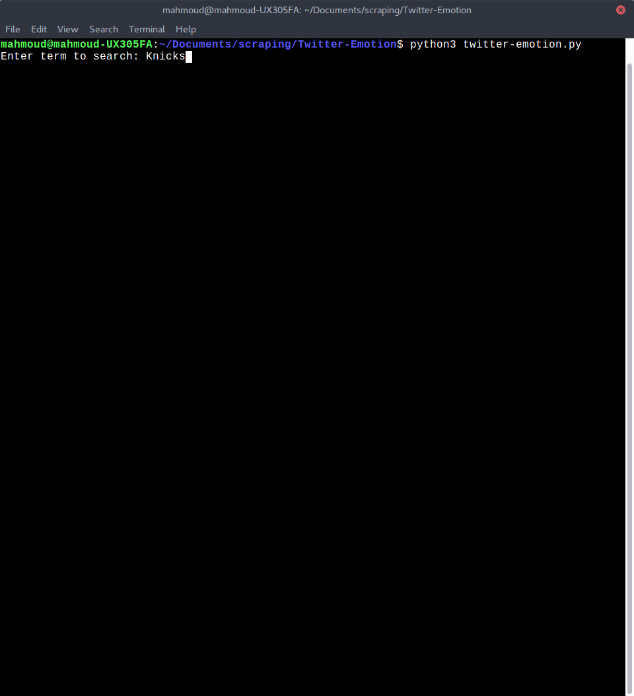
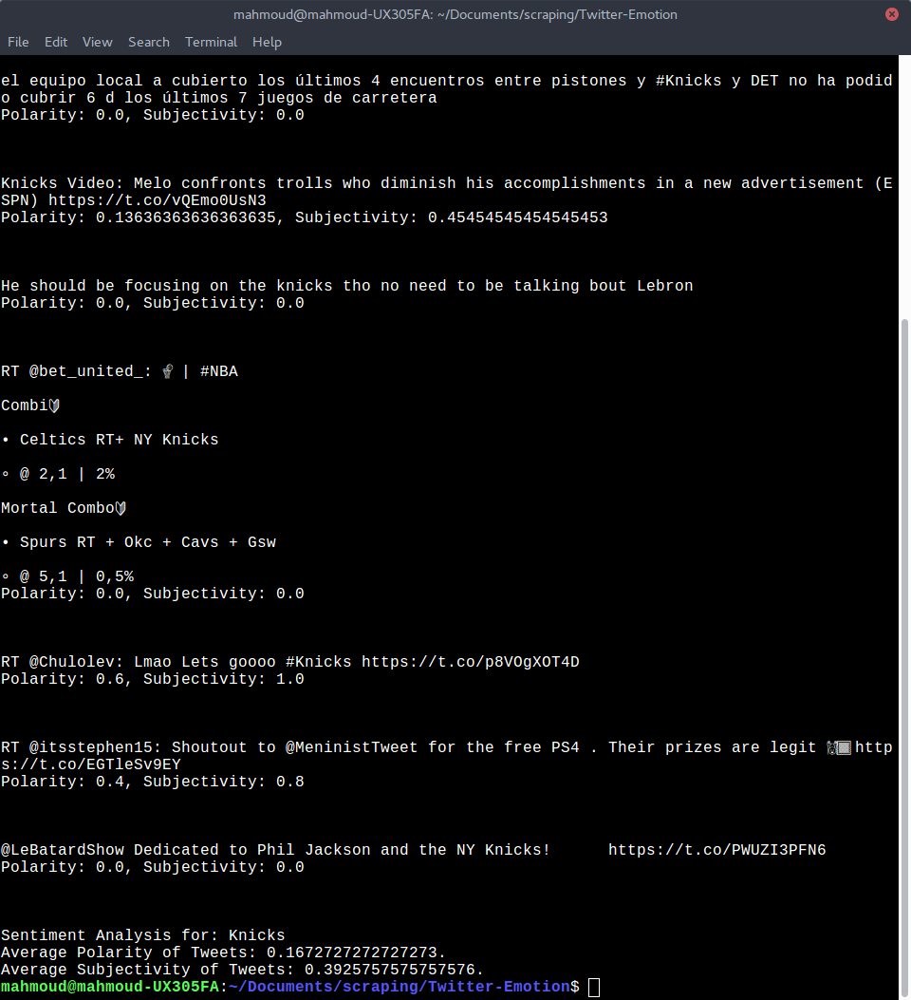

# Twitter-Emotion
Perform sentiment analysis on tweets.                
In order to run the code, go into a terminal and go to the directory where you cloned the repository and type
```
python3 twitter-emotion.py
```              
        
Enter your search term at the console.                   
Upon entering you search term, the application will go through twitter and find tweets that contain your search term. Then it will perform sentiment analysis on them in order to determine the general attitude of people towards the search term. 


     

     